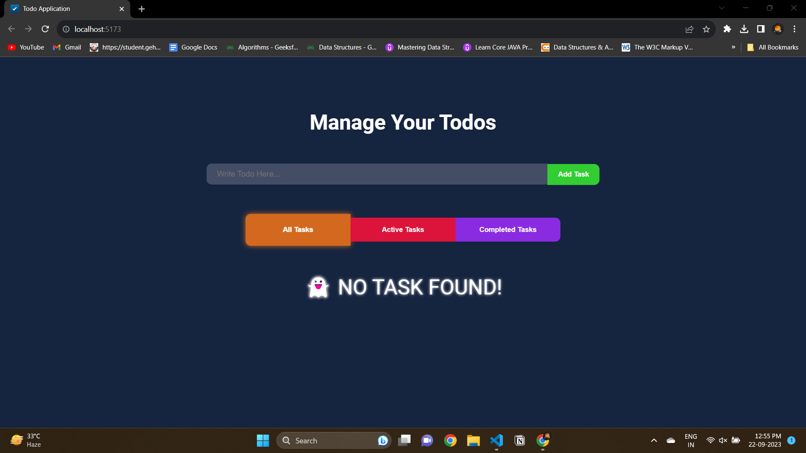
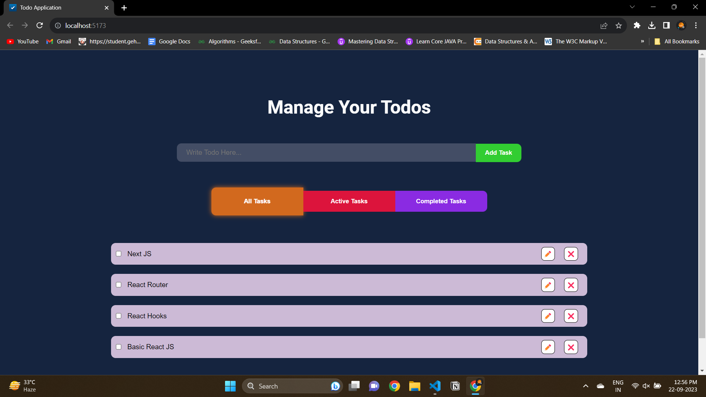
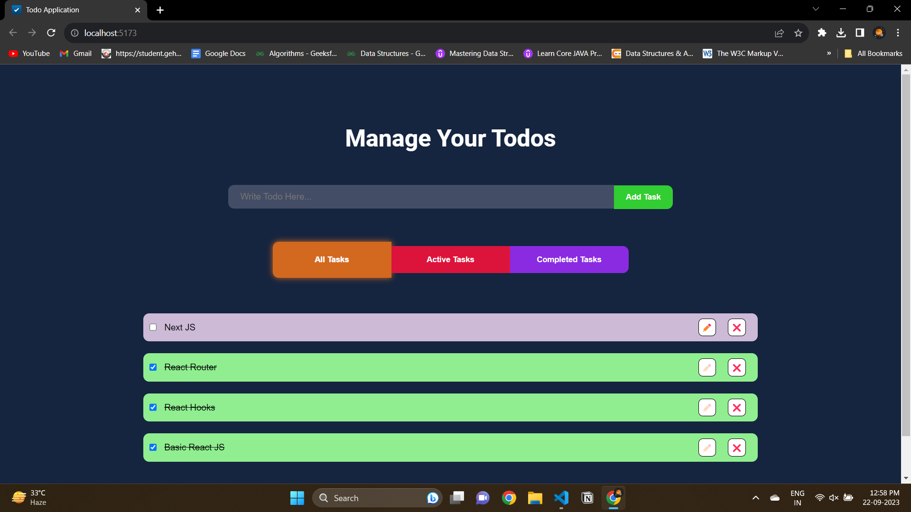
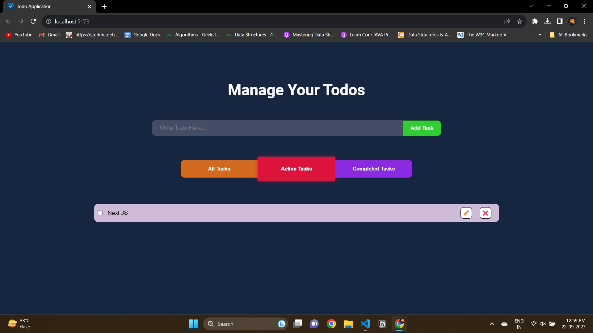
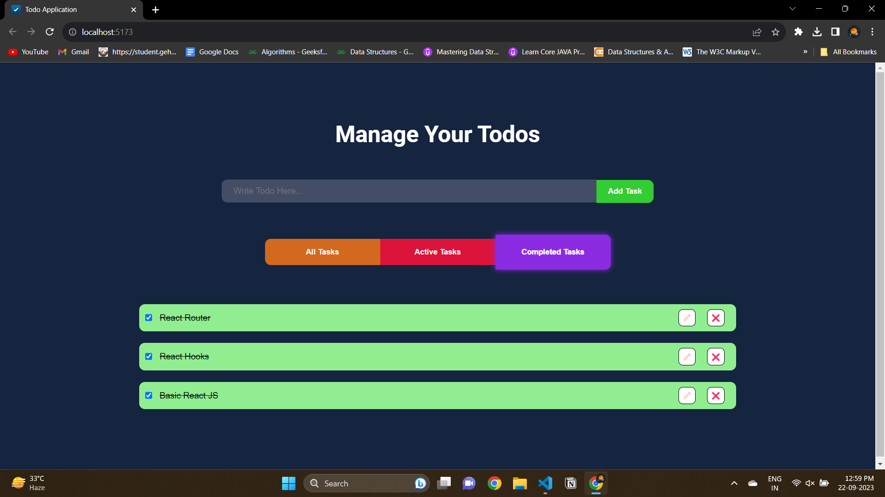

# Task Manager Application

1. It is a todo application where an individual can track his/her daily tasks.
2. Features Available are:
    1. Add New Task
    2. Update Task
    3. Delete Task
    4. Toggle Task - completed/uncompleted
3. Also, This application has a feature to show all tasks or which tasks are active or completed right now
4. You can switch between All Tasks, Active Task and Completed Task seamlessly
5. Even if you refresh the page, the task that has been added will not be deleted.
6. The Application is Responsive in nature.

##### LIVE LINK OF THE PROJECT: [LIVE PROJECT LINK](https://task-manager-application-rosy.vercel.app/)

## Technology Stack

1. HTML5
2. CSS3
3. Javascript
4. ReactJS

#### Additional Stack are:

1. Context API
2. Local Storage
3. Responsive Design

## Images related to the project

##### LIVE LINK OF THE PROJECT: [LIVE PROJECT LINK](https://task-manager-application-rosy.vercel.app/)
